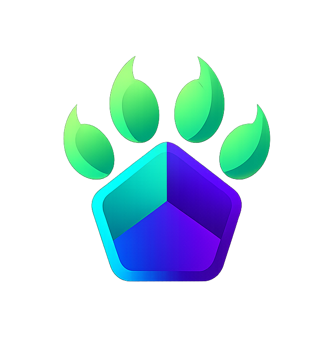
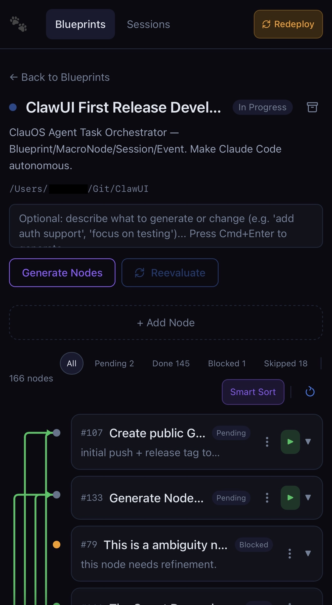
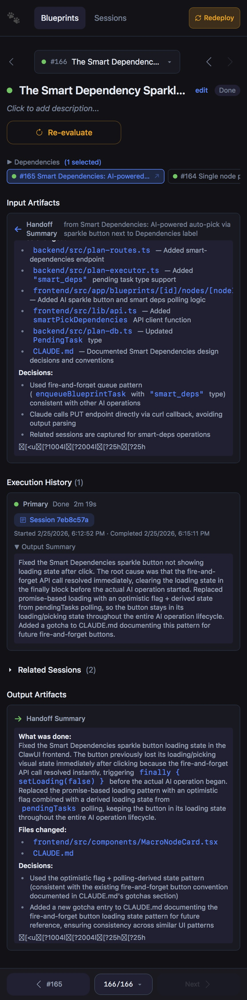

<p align="center">
  <br>
  <strong>ClawUI</strong><br>
  A Claude Code Orchestrator with User/Agent Interface<br><br>
  <a href="https://github.com/ccchow/ClawUI/actions/workflows/ci.yml"></a>
  <a href="https://www.npmjs.com/package/@clawui/cli"></a>
  = 20">
  
  <a href="https://github.com/ccchow/ClawUI/blob/main/LICENSE"></a>
  <a href="https://github.com/ccchow/ClawUI/blob/main/CONTRIBUTING.md"></a>
</p>

> **Turn your linear Claude Code CLI into a macro-planning Node Graph.**

ClawUI transforms Claude Code from a simple chat interface into an autonomous project manager. It visualizes complex tasks as a **Blueprint DAG**, executes them node-by-node with full context isolation, and **reuses sessions and artifacts** across the graph — solving context window explosion and terminal scroll fatigue while dramatically improving token efficiency.

## Screenshots

| Blueprint List | Task Node List |
|---|---|
|  |  |

| Task Node Detail | Claude Code Session |
|---|---|
|  |  |

| Mobile Blueprint List | Mobile Node Detail |
|---|---|
|  |  |

## ✨ Why ClawUI?

* **🗺️ From Terminal to DAG:** Visualize macro-plans as a node graph. Let Claude plan the architecture, and execute it node-by-node.
* **♻️ Session Reuse, Not Session Waste:** In typical Claude Code workflows, sessions are fire-and-forget — all that context and token spend is lost. ClawUI **resumes** sessions on retry, **passes AI-distilled handoff artifacts** (not raw logs) to downstream nodes, and **keeps every session indexed and searchable**. The result: higher token efficiency, lower costs, and a compounding knowledge base.
* **⚡ Proactive Copilot:** When a session pauses, AI proposes the top 3 next actions as one-click buttons — no typing required.
* **🔒 100% Local & Secure:** Runs on top of your local `~/.claude/` directory. No external cloud relays, no code leaving your machine.

---

## 🚀 Core Features

### 1. AI-Powered Planning — From Idea to DAG


* **Smart Task Creation** — Describe a goal (e.g., *"add OAuth login"*). Claude analyzes your codebase and generates implementation-ready nodes with file paths and acceptance criteria, grounded in real code.
* **Smart Dependency Selection** — AI auto-wires dependency edges between nodes. Re-run analysis on any node with one click.
* **Smart Task Decomposition** — Split oversized nodes into 2-3 sub-nodes. Downstream edges are automatically rewired.

### 2. Autonomous Execution — Self-Healing Task Graph



* **Grounded Execution Context** — Each node gets its own Claude Code session with AI-distilled handoff artifacts from upstream dependencies — concise context in a fraction of the tokens a full replay would cost.
* **Post-Completion Evaluation** — AI evaluates each completed node: **COMPLETE** (continue), **NEEDS_REFINEMENT** (insert follow-up), or **HAS_BLOCKER** (create blocker sibling). The graph mutates itself at runtime.
* **Smart Retry & Session Resume** — Failed nodes resume the *same* session with a lightweight continuation prompt. Zero wasted tokens re-explaining the task.
* **Run All** — One click queues all eligible nodes in dependency order. Failures pause the graph for human review.

### 3. Session Timeline — Full Observability

Every Claude Code interaction is captured as a rich, interactive timeline with structured I/O views, proactive suggestion buttons, and full session management (star, tag, search, filter).

---

## 🛠 Quick Start

### Prerequisites

* **Node.js 20+** and **npm 10+**
* **Claude Code CLI** installed globally
* **macOS or Linux** (requires `/usr/bin/expect` for TTY wrapping)

### Option A: Install via npm (recommended)

```bash
# Run directly (installs on first run, then starts)
npx @clawui/cli

# Or install globally for repeated use
npm install -g @clawui/cli
claw-ui
```

**Custom ports:** `PORT=4001 FRONTEND_PORT=4000 npx @clawui/cli`

### Option B: Clone from source

```bash
git clone https://github.com/ccchow/ClawUI.git
cd ClawUI
npm install
npm run dev
```

Open the secure URL (with auth token) printed in the terminal.

### Before You Start: Configure Your Claude Code Environment

**Before creating your first Blueprint**, configure these for best results:

* **`CLAUDE.md`** — Run `/init` in Claude Code to generate one. Every node execution reads it automatically for persistent project context.
* **MCP Servers** — Connect external tools (Playwright, databases, etc.) via [MCP](https://modelcontextprotocol.io/). Node prompts auto-hint available tools.
* **Skills & Plugins** — Nodes inherit all skills/plugins from your `~/.claude/` directory. **Strongly recommended:**

  ```bash
  /plugin install claude-md-management@claude-plugins-official
  ```

A well-configured environment = higher-quality nodes + fewer retries = significant token savings.

---

## 🏗 System Architecture



*Delete `.clawui/` anytime to reset — Layer 2 rebuilds from raw JSONL in seconds.* See [Data Model](docs/DATA-MODEL.md) and [Blueprint System](docs/PLAN-SYSTEM.md).

---

## 🔌 API Reference

<details>
<summary><b>Session APIs</b></summary>

| Method | Path | Description |
| --- | --- | --- |
| GET | `/api/projects` | List all Claude Code projects |
| GET | `/api/projects/:id/sessions` | List sessions with enrichment data |
| GET | `/api/sessions/:id/timeline` | Get timeline nodes from SQLite |
| GET | `/api/sessions/:id/last-message` | Lightweight poll for latest node |
| GET | `/api/sessions/:id/health` | Analyze session context health |
| POST | `/api/sessions/:id/run` | Execute prompt, returns `{ output, suggestions }` |
| PATCH | `/api/sessions/:id/meta` | Update session enrichment (star, tags, notes, archive) |
| PATCH | `/api/nodes/:id/meta` | Update node enrichment |
| GET | `/api/tags` | List all tags |
| GET | `/api/state` | Get app state |
| PUT | `/api/state` | Update app state |
| GET | `/api/sync` | Trigger manual re-sync |
| GET | `/api/global-status` | Aggregate queue info across all blueprints |

</details>

<details>
<summary><b>Blueprint CRUD</b></summary>

| Method | Path | Description |
| --- | --- | --- |
| POST | `/api/blueprints` | Create blueprint with project directory |
| GET | `/api/blueprints` | List blueprints (filter by status, project, archived) |
| GET | `/api/blueprints/:id` | Get blueprint with all nodes |
| PUT | `/api/blueprints/:id` | Update blueprint metadata |
| DELETE | `/api/blueprints/:id` | Delete blueprint and all nodes |
| POST | `/api/blueprints/:id/archive` | Archive blueprint |
| POST | `/api/blueprints/:id/unarchive` | Unarchive blueprint |
| POST | `/api/blueprints/:id/approve` | Set status to approved |

</details>

<details>
<summary><b>Node CRUD & Batch Operations</b></summary>

| Method | Path | Description |
| --- | --- | --- |
| POST | `/api/blueprints/:id/nodes` | Add single node |
| PUT | `/api/blueprints/:id/nodes/:nodeId` | Edit node |
| DELETE | `/api/blueprints/:id/nodes/:nodeId` | Delete node |
| POST | `/api/blueprints/:id/nodes/reorder` | Reorder nodes |
| PUT | `/api/blueprints/:id/nodes/batch` | Batch update multiple nodes |
| POST | `/api/blueprints/:id/nodes/batch-create` | Create multiple nodes with inter-batch deps |

</details>

<details>
<summary><b>AI-Powered Operations</b></summary>

| Method | Path | Description |
| --- | --- | --- |
| POST | `/api/blueprints/:id/generate` | AI-generate nodes from description |
| POST | `/api/blueprints/:id/reevaluate-all` | AI reevaluate all non-done nodes |
| POST | `/api/blueprints/:id/enrich-node` | AI-enrich node title & description |
| POST | `/api/blueprints/:id/nodes/:nodeId/reevaluate` | AI reevaluate single node |
| POST | `/api/blueprints/:id/nodes/:nodeId/split` | AI decompose node into 2-3 sub-nodes |
| POST | `/api/blueprints/:id/nodes/:nodeId/smart-dependencies` | AI auto-pick dependencies |
| POST | `/api/blueprints/:id/nodes/:nodeId/evaluate` | AI post-completion evaluation |

</details>

<details>
<summary><b>Execution & Queue Control</b></summary>

| Method | Path | Description |
| --- | --- | --- |
| POST | `/api/blueprints/:id/nodes/:nodeId/run` | Run single node (fire-and-forget) |
| POST | `/api/blueprints/:id/run` | Run next pending node |
| POST | `/api/blueprints/:id/run-all` | Run all pending nodes in dependency order |
| POST | `/api/blueprints/:id/nodes/:nodeId/unqueue` | Cancel queued node, revert to pending |
| POST | `/api/blueprints/:id/nodes/:nodeId/resume-session` | Resume failed node in existing session |
| POST | `/api/blueprints/:id/nodes/:nodeId/recover-session` | Find and link lost session |
| GET | `/api/blueprints/:id/queue` | Get queue info for blueprint |
| GET | `/api/blueprints/:id/nodes/:nodeId/executions` | Get execution history |
| GET | `/api/blueprints/:id/nodes/:nodeId/related-sessions` | Sessions from interactive ops |
| GET | `/api/blueprints/:id/nodes/:nodeId/artifacts` | Get node artifacts |
| POST | `/api/blueprints/:id/nodes/:nodeId/artifacts` | Create artifact |

</details>

<details>
<summary><b>Execution Callbacks (called by Claude Code during execution)</b></summary>

| Method | Path | Description |
| --- | --- | --- |
| POST | `/api/blueprints/:id/nodes/:nodeId/evaluation-callback` | Post-completion evaluation result |
| POST | `/api/blueprints/:id/executions/:execId/report-blocker` | Report execution blocker |
| POST | `/api/blueprints/:id/executions/:execId/task-summary` | Report task completion summary |
| POST | `/api/blueprints/:id/executions/:execId/report-status` | Authoritative execution status |

</details>

## Security

* **Localhost-only** — Both backend (:3001) and frontend (:3000) bind to `127.0.0.1`. Remote access via [Tailscale](https://tailscale.com/): `tailscale serve --bg 3000`.
* **Auth token** — Random token generated on each startup, required on all `/api/*` requests. CORS locked to `127.0.0.1:3000`.
* **`--dangerously-skip-permissions`** — Required by Claude Code for programmatic use. ClawUI passes it automatically; this is a Claude Code requirement, not a ClawUI design choice.

## 🔮 Coming Soon

- **OpenClaw/Pi Support** — Open protocol for agent orchestration UIs to work with any coding agent backend.
- **Codex CLI Support**
- **Windows Support**

## 🤝 Contributing

ClawUI can serve as its own development environment — point a Blueprint at this repo and let Claude Code build features through the very UI you're improving.

1. **Fork & clone**, run `npm install && npm run dev`
2. **Create a Blueprint** with your repo path as workspace
3. **Describe what you want to build** — ClawUI decomposes and executes it node by node
4. **Review & PR** — see [CONTRIBUTING.md](CONTRIBUTING.md) for guidelines

## ⚖️ Disclaimer & Legal

ClawUI is an independent, unofficial community open-source project.

> It is **NOT** affiliated with, endorsed by, or associated with Anthropic PBC. "Claude" and "Claude Code" are trademarks of Anthropic.

ClawUI acts strictly as a local GUI orchestrator and does not distribute, modify, or bundle the proprietary claude-code CLI tool. Users must install and authenticate Claude Code independently, adhering to Anthropic's [Consumer Terms of Service](https://www.anthropic.com/legal/consumer-terms) and [Commercial Terms of Service](https://www.anthropic.com/legal/commercial-terms). ClawUI is designed exclusively for local, self-hosted usage by the authenticated individual, and must not be used to multiplex or proxy third-party traffic through a single Claude subscription.

## 📄 License

MIT License (c) 2025-2026. See [LICENSE](LICENSE) for details.
