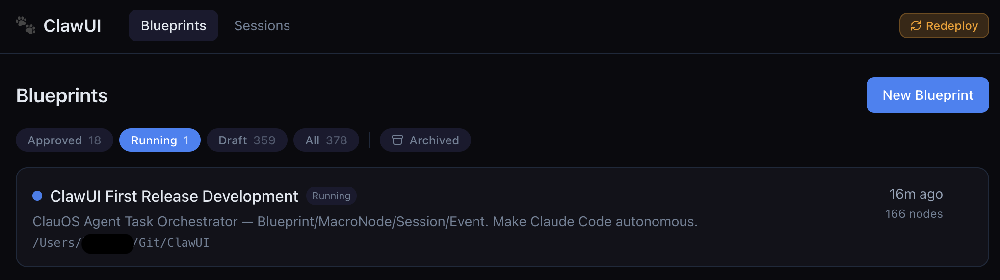
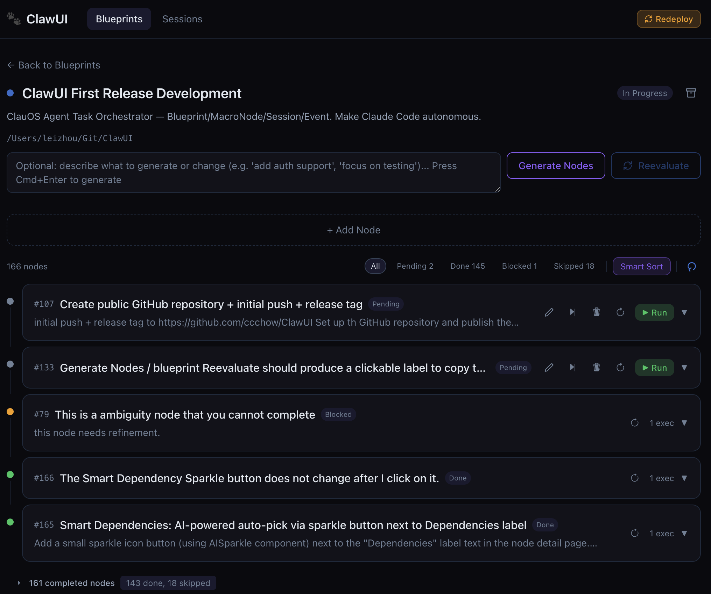
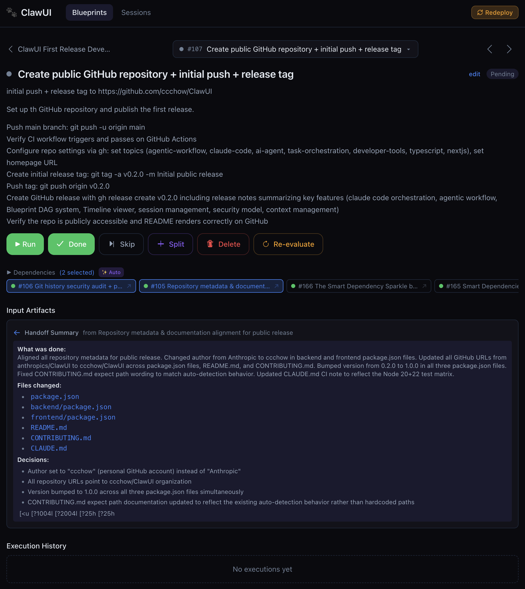
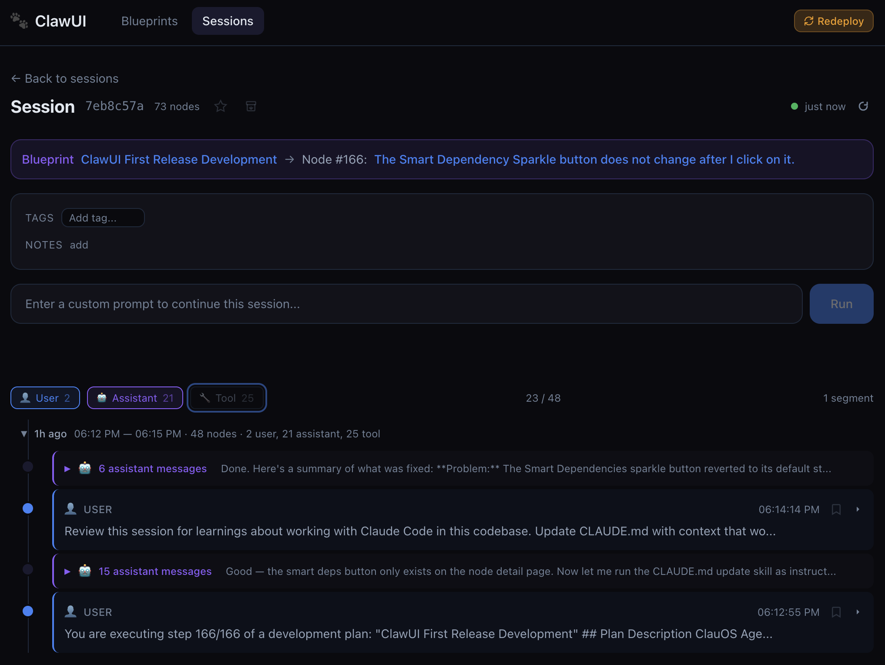

# ClawUI: The Visual Orchestrator for Claude Code

> **Turn your linear Claude Code CLI into a macro-planning Node Graph.**

ClawUI is a next-generation visual dashboard and orchestration engine for Claude Code. It solves the biggest pain points of complex AI coding tasks: context window explosion and terminal scroll fatigue.

By upgrading your CLI experience with a **Blueprint DAG (Directed Acyclic Graph) System** and **Proactive Next Actions**, ClawUI transforms Claude Code from a simple chat interface into an autonomous, long-term project manager.

## Screenshots

| Blueprint List | Task Node List |
|---|---|
|  |  |

| Task Node Detail | Claude Code Session |
|---|---|
|  |  |

## ✨ Why ClawUI?

* **🗺️ From Terminal to DAG:** Stop scrolling through endless terminal logs. ClawUI visualizes your macro-plans as a node graph. Let Claude plan the architecture, and execute it node-by-node.
* **⚡ Proactive Copilot:** Whenever a session pauses, ClawUI predicts your next moves. Click one of the 3 AI-generated suggestion buttons to inject commands directly into the CLI—no typing required.
* **🧩 Context Boundary Control:** Execute nodes in dependency order. Artifacts from completed nodes are automatically passed downstream, perfectly isolating context and preventing LLM hallucinations.
* **🔒 100% Local & Secure:** ClawUI sits directly on top of your local `~/.claude/` directory. No external cloud relays, no code leaving your machine (other than standard Anthropic API calls).

---

## 🚀 Core Features

### 1. The Blueprint System (Task Orchestration)

The Blueprint system brings structured task decomposition to Claude Code:

* **AI-Powered Decomposition:** Describe a high-level goal, and ClawUI will automatically generate an ordered DAG (Directed Acyclic Graph) of tasks.
* **Dependency-Aware Execution:** Nodes execute in strict order. State and context are handed off perfectly from upstream to downstream tasks.
* **Node-Level Interception:** Run, retry, skip, or manually edit prompts for any specific node before executing it.

### 2. The Timeline Viewer (Session Observability)

A beautiful, Linear-style vertical timeline for every interaction:

* **Rich I/O Parsing:** Collapsible views for Bash execution, File Edits, and Read operations.
* **Interactive Continuation:** AI analyzes the terminal output and suggests Top 3 Next Actions to keep the momentum going.
* **Session Management:** Star, tag, filter, and search through your entire Claude Code history.

---

## 🛠 Quick Start

### Prerequisites

* **Node.js 20+** and **npm 10+**
* **Claude Code CLI** installed globally
* **macOS or Linux** (requires `/usr/bin/expect` for TTY wrapping)

### Installation

```bash
# Clone the repository and install dependencies
git clone https://github.com/ccchow/ClawUI.git
cd ClawUI
npm install

# Start the full stack (Express backend :3001 + Next.js frontend :3000)
npm run dev

```

Open the secure URL printed in the terminal to access your dashboard (includes an auth token).

---

## 🏗 System Architecture

ClawUI operates on a highly optimized, non-intrusive 4-layer data architecture that treats your native Claude logs as the single source of truth.

```text
~/.claude/projects/**/*.jsonl     <- Layer 1: Raw Source (Read-only single source of truth)
        |
.clawui/index.db (SQLite)         <- Layer 2: Ultra-fast Index/Cache (Incremental sync)
.clawui/enrichments.json          <- Layer 3: User Meta (Stars, tags, bookmarks)
.clawui/app-state.json            <- Layer 4: UI Preferences
        |
Backend (Express :3001)           -> REST API & Process Manager
        |
Frontend (Next.js :3000)          -> DAG UI & Timeline Controller

```

*Delete the `.clawui/` directory anytime to reset. Layer 2 automatically rebuilds from your raw JSONL files in seconds.* 👉 Dive deeper into our [Four-Layer Data Model](docs/DATA-MODEL.md) and [Blueprint System Design](docs/PLAN-SYSTEM.md).

---

## 🔌 API Reference

ClawUI exposes a robust REST API for both Session monitoring and Blueprint execution.
*(Expand to view core endpoints)*

<details>
<summary><b>Session & Node APIs</b></summary>

| Method | Path | Description |
| --- | --- | --- |
| GET | `/api/projects` | List all Claude Code projects |
| GET | `/api/sessions/:id/timeline` | Parse session into rich timeline nodes |
| POST | `/api/sessions/:id/run` | Execute prompt, returns `{ output, suggestions }` |
| POST | `/api/blueprints/:id/generate` | AI-generate nodes from description |
| POST | `/api/blueprints/:id/nodes/:nodeId/run` | Execute a single node in a dedicated session |

</details>

## Security

ClawUI enforces a **dual-layer isolation** model to protect your machine:

### Network Layer — Localhost Lockdown

Both the backend (Express :3001) and frontend (Next.js :3000) bind exclusively to `127.0.0.1`. Direct connections from other devices on your LAN are refused at the TCP level. Remote access (e.g., from a phone or tablet) is handled by running `tailscale serve` as an external reverse proxy — ClawUI itself never listens on `0.0.0.0`.

### Application Layer — Local Auth Token

On every backend startup, a cryptographically random token is generated and written to `.clawui/auth-token`. All `/api/*` requests must include this token via the `x-clawui-token` header (or `?auth=` query param for initial browser access). The token rotates on each restart.

```text
# The terminal prints a secure URL on startup:
========================================================
  ClawUI Secure Dashboard Ready
  Local:     http://localhost:3000
  Tailscale: http://<your-tailscale-ip>:3000/?auth=<token>
========================================================
```

On first visit, the frontend extracts the token from the URL, stores it in `localStorage`, and strips the parameter from the address bar.

### Other Notes

- **`--dangerously-skip-permissions` flag**: Claude Code requires this flag for non-interactive (programmatic) use. ClawUI passes it automatically when executing prompts via `claude --resume`. This is a Claude Code requirement, not a ClawUI design choice.
- **CORS** is locked to `http://127.0.0.1:3000` — only the local frontend origin is allowed.
- **Tailscale recommended** for remote access. Run `tailscale serve --bg 3000` to securely expose the dashboard to your Tailnet.

## 🔮 Coming Soon

- **OpenClaw/Pi Support** — A standardized, open protocol for agent orchestration UIs to communicate with any coding agent backend. Decouple the frontend from Claude Code specifics so ClawUI (and other tools) can orchestrate any LLM-powered coding agent.

## 🤝 Contributing

**ClawUI is the rare project that can serve as its own development environment.** Point ClawUI at this repo as a Blueprint workspace, and you can build new features, fix bugs, and submit patches — all from a browser on your desktop or phone, orchestrated by Claude Code through the very UI you're improving.

This makes contributing uniquely accessible:

1. **Fork & clone** the repo, run `npm install && npm run dev`
2. **Create a Blueprint** in ClawUI with your repo path as the workspace
3. **Describe what you want to build** — ClawUI decomposes it into executable nodes
4. **Watch Claude Code implement it**, node by node, with full context isolation
5. **Review the results** in the Timeline viewer, then open a PR

No deep familiarity with the codebase required to get started — the Blueprint system gives Claude Code the structure it needs to navigate the architecture on its own.

See [CONTRIBUTING.md](CONTRIBUTING.md) for code style, dev/stable environment setup, and PR guidelines.

## 📄 License

MIT License (c) 2025-2026. See [LICENSE](LICENSE) for details.