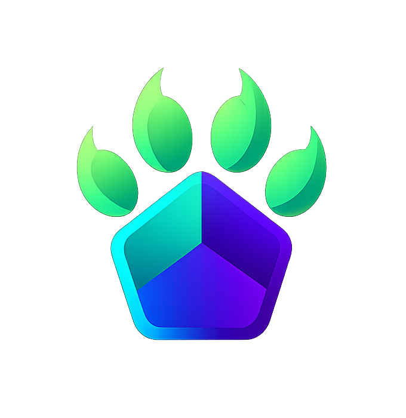
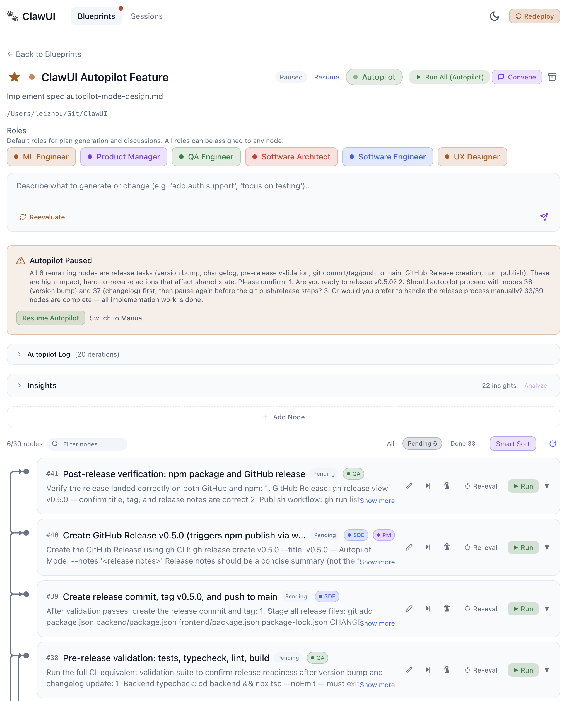
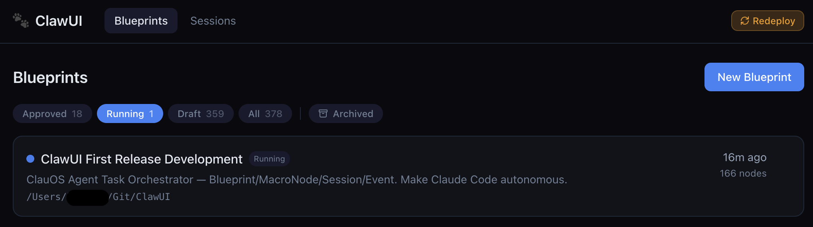
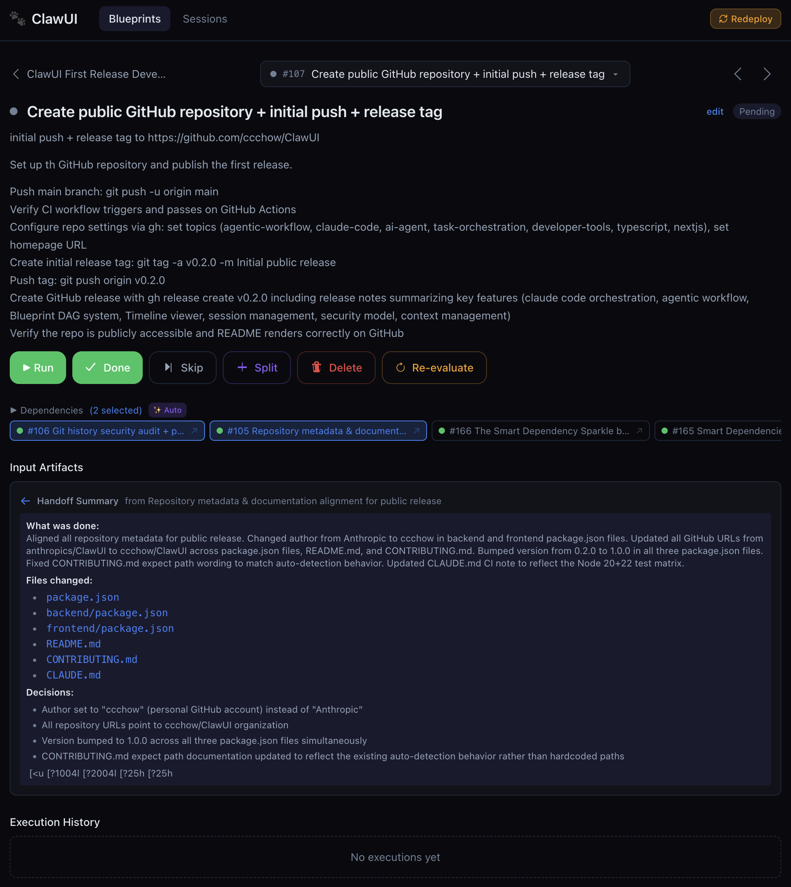
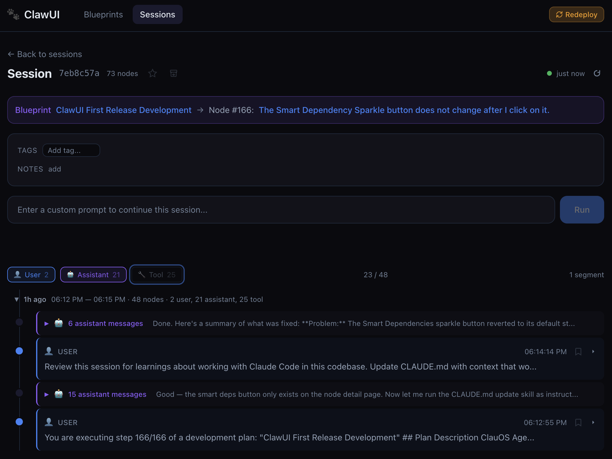
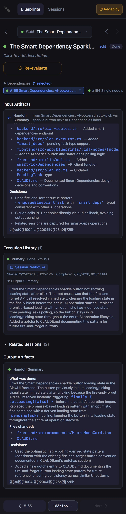

<p align="center">
  <br>
  <strong>ClawUI</strong><br>
  Autonomous Orchestrator for CLI Coding Agents<br><br>
  <a href="https://github.com/ccchow/ClawUI/actions/workflows/ci.yml"></a>
  <a href="https://www.npmjs.com/package/@clawui/cli"></a>
  = 20">
  
  <a href="https://github.com/ccchow/ClawUI/blob/main/LICENSE"></a>
  <a href="https://github.com/ccchow/ClawUI/blob/main/CONTRIBUTING.md"></a>
</p>

> **Make your CLI coding agent observable, proactive, and autonomous.**

CLI coding agents are powerful — but opaque. You launch a task, lose visibility, and hope for the best. ClawUI changes that. It wraps any CLI agent (Claude Code, OpenClaw, Codex, Pi) with a visual orchestration layer that decomposes complex goals into a **Blueprint DAG**, then drives execution through an **Autopilot** loop capable of self-reflection, adaptive re-planning, and error recovery — all while you watch, or walk away.

<p align="center">
  <br>
  <em>Autopilot paused after 20 iterations — awaiting human confirmation before release tasks.
  <br>The agent planned, executed, reflected, and adapted the blueprint autonomously.</em>
</p>

---

## Three Pillars

### 1. Observable

Every agent action is captured and visualized in real time. No more guessing what your agent is doing inside a terminal.

- **Blueprint DAG** — Complex tasks decomposed into a dependency graph of nodes, each with status, role, and execution history.
- **Session Timeline** — Every Claude Code interaction rendered as a structured, searchable timeline with I/O views.
- **Autopilot Log** — A decision-by-decision audit trail: what the agent chose, why, whether it succeeded, and how long it took.
- **Blueprint Insights** — Cross-cutting observations surfaced by the agent during execution (warnings, blockers, optimization opportunities).

### 2. Proactive with Reflection

The agent doesn't just follow a static plan — it thinks about what it's doing and adapts.

- **Memory & Reflection** — Every N iterations, the autopilot pauses to reflect: What's working? What patterns am I seeing? What should I try differently? Reflections are stored as per-blueprint memory and global strategy, injected into future decisions.
- **Post-Completion Evaluation** — After each node finishes, AI evaluates the result: COMPLETE, NEEDS_REFINEMENT (insert follow-up), or HAS_BLOCKER (create blocker sibling). The graph mutates itself at runtime.
- **19-Tool Decision Palette** — The autopilot doesn't just "run the next node." It chooses from 19 actions: execute, enrich, split, reevaluate, skip, add nodes, rewire dependencies, triage suggestions, create insights, pause for human input, and more.
- **Proactive Suggestions** — When a session pauses, AI proposes the top next actions as one-click buttons.

### 3. Autonomous

Point it at a goal and let it drive — with guardrails.

- **Autopilot Loop** — An observe-decide-execute cycle that iterates over the blueprint, picking the highest-impact action each round. It handles the full lifecycle: planning, execution, evaluation, error recovery, and completion.
- **Adaptive Re-Planning** — When a node fails or reveals unexpected complexity, the agent can split it, add new nodes, rewire dependencies, or skip and move on — dynamically discovering new critical paths to reach the goal.
- **Error Recovery** — Failed nodes are resumed in the same session with targeted feedback. If resuming doesn't work, the agent tries splitting, re-enriching, or escalating. Multi-attempt tracking prevents infinite retry loops.
- **Guardrails** — Max iteration limits, idle-iteration detection with auto-pause, per-node attempt caps, and explicit pause-for-human-review when the agent encounters high-stakes decisions (destructive operations, ambiguous requirements, release gates).

---

## Quick Start

### Prerequisites

- **Node.js 20+** and **npm 10+**
- **Claude Code CLI** (or another supported agent — see [Multi-Agent Support](#multi-agent-support))
- **macOS, Linux, or Windows**

### Install & Run

```bash
# One command — installs on first run, then starts
npx @clawui/cli

# Or install globally
npm install -g @clawui/cli
claw-ui
```

Open the secure URL (with auth token) printed in the terminal. Custom ports: `PORT=4001 FRONTEND_PORT=4000 npx @clawui/cli`

### From Source

```bash
git clone https://github.com/ccchow/ClawUI.git
cd ClawUI && npm install && npm run dev
```

### First Blueprint

1. Click **New Blueprint**, enter your project directory and a goal (e.g., *"add OAuth login with Google and GitHub providers"*).
2. AI analyzes your codebase and generates implementation-ready nodes with file paths, acceptance criteria, and dependency edges.
3. Click **Autopilot** to let the agent drive — or **Run All** for step-by-step manual execution.
4. Watch the autopilot log as the agent executes, evaluates, reflects, and adapts. Pause anytime to intervene.

**Tip:** A well-configured `CLAUDE.md` + MCP servers + skills dramatically improves node quality and reduces retries.

---

## How Autopilot Works

```
         ┌──────────┐
    ┌───>│ OBSERVE   │ ── Collect node statuses, insights, suggestions, queue state
    │    └────┬─────┘
    │         v
    │    ┌──────────┐
    │    │ REFLECT   │ ── Every N iterations: update per-blueprint + global memory
    │    └────┬─────┘
    │         v
    │    ┌──────────┐
    │    │ DECIDE    │ ── Choose from 19 tools based on state + memory + strategy
    │    └────┬─────┘
    │         v
    │    ┌──────────┐
    │    │ EXECUTE   │ ── Run the chosen action (execute node, split, enrich, pause...)
    │    └────┬─────┘
    │         v
    │    ┌──────────┐
    └────│ EVALUATE  │ ── Check result, update graph, loop or pause
         └──────────┘
```

The agent builds a **state snapshot** each iteration — a token-efficient summary of the entire blueprint — and reasons about the best next move. Its memory accumulates across iterations, so it gets smarter about the specific blueprint over time. When it finishes, it runs a global reflection to carry lessons into future blueprints.

---

## Architecture

```
You (browser)  ◄──►  Next.js frontend (:3000)  ◄──►  Express backend (:3001)  ◄──►  Agent CLI
                                                              │
                                                        SQLite + JSONL
                                                      (100% local data)
```

- **Four-layer data model**: Raw JSONL (read-only) → SQLite index → Enrichments → App state. See [Data Model](docs/DATA-MODEL.md).
- **Pluggable agent runtimes**: Claude Code, OpenClaw, Codex, Pi Mono. See [Multi-Agent Support](#multi-agent-support).
- **Localhost-only**: Both servers bind to `127.0.0.1`. Remote access via `tailscale serve`.

---

## Multi-Agent Support

Switch agent backend via the `AGENT_TYPE` environment variable:

| Agent | `AGENT_TYPE` | Description |
|---|---|---|
| **Claude Code** | `claude` (default) | Anthropic's official CLI |
| **OpenClaw** | `openclaw` | Open-source agent framework |
| **Pi Mono** | `pi` | Lightweight coding agent |
| **Codex CLI** | `codex` | OpenAI's Codex CLI agent |

```bash
AGENT_TYPE=openclaw npx @clawui/cli
```

---

## Role System

Blueprints support a multi-role mechanism that tailors prompts and evaluation per node:

| Role | Focus |
|---|---|
| **SDE** (Software Developer) | Implementation, code quality, architecture |
| **QA** (Quality Assurance) | Testing, validation, edge cases |
| **PM** (Product Manager) | Requirements, acceptance criteria, user stories |

Set defaults at the blueprint level; override per-node as needed.

---

## More Screenshots

| Blueprint List | Task Node Detail |
|---|---|
|  |  |

| Session Timeline | Mobile View |
|---|---|
|  |  |

---

## Contributing

ClawUI can serve as its own development environment — point a Blueprint at this repo and let the agent build features through the very UI you're improving.

1. Fork & clone, run `npm install && npm run dev`
2. Create a Blueprint with your repo path as workspace
3. Describe what you want to build — ClawUI decomposes and executes it
4. Review & PR — see [CONTRIBUTING.md](CONTRIBUTING.md)

---

## Disclaimer & Legal

ClawUI is an independent, unofficial community open-source project. It is **not** affiliated with, endorsed by, or associated with Anthropic PBC. "Claude" and "Claude Code" are trademarks of Anthropic.

ClawUI acts as a local GUI orchestrator and does not distribute, modify, or bundle proprietary CLI tools. Users must install and authenticate their chosen agent CLI independently. Designed exclusively for local, self-hosted usage by the authenticated individual.

## License

MIT License (c) 2025-2026. See [LICENSE](LICENSE) for details.
