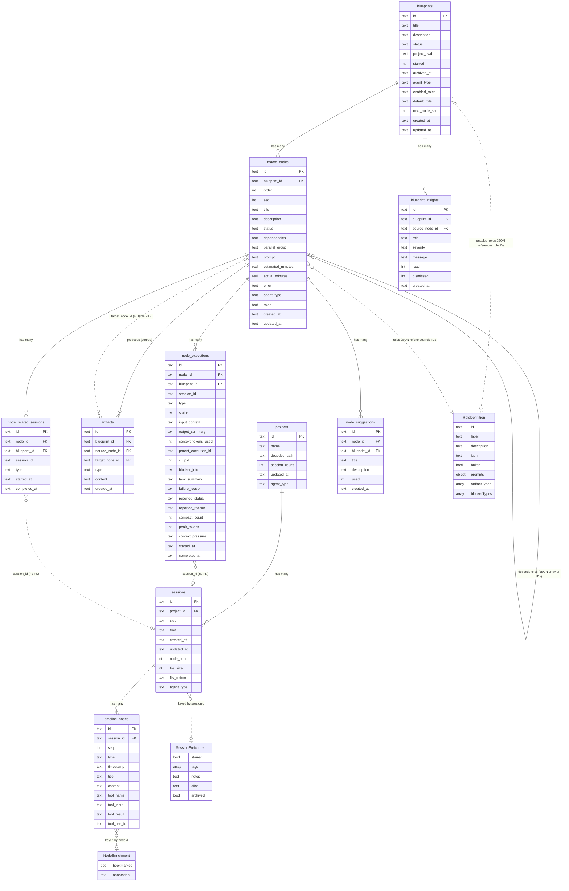

# Domain Model Audit

**Date**: 2026-03-01
**Scope**: All persistent entities across SQLite tables, JSON files, and in-memory registries
**Goal**: Map entities and relationships, identify inconsistencies, propose simplifications

---

## 1. Entity Map

### 1.1 SQLite Tables (Layer 2 — `index.db`)

#### Session Viewer Subsystem

| Table | PK | Fields | Owner |
|---|---|---|---|
| **projects** | `id TEXT` | `name`, `decoded_path`, `session_count`, `updated_at`, `agent_type` | Top-level |
| **sessions** | `id TEXT` | `project_id` FK→projects, `slug`, `cwd`, `created_at`, `updated_at`, `node_count`, `file_size`, `file_mtime`, `agent_type` | projects |
| **timeline_nodes** | `id TEXT` | `session_id` FK→sessions, `seq`, `type`, `timestamp`, `title`, `content`, `tool_name`, `tool_input`, `tool_result`, `tool_use_id` | sessions |

#### Plan/Blueprint Subsystem

| Table | PK | Fields | Owner |
|---|---|---|---|
| **blueprints** | `id TEXT` | `title`, `description`, `status`, `project_cwd`, `starred`, `archived_at`, `agent_type`, `enabled_roles` (JSON array TEXT), `default_role`, `next_node_seq`, `created_at`, `updated_at` | Top-level |
| **macro_nodes** | `id TEXT` | `blueprint_id` FK→blueprints, `order`, `seq`, `title`, `description`, `status`, `dependencies` (JSON array TEXT), `parallel_group`, `prompt`, `estimated_minutes`, `actual_minutes`, `error`, `agent_type`, `roles` (JSON array TEXT), `created_at`, `updated_at` | blueprints |
| **artifacts** | `id TEXT` | `blueprint_id` FK→blueprints, `source_node_id` FK→macro_nodes, `target_node_id` FK→macro_nodes (nullable), `type`, `content`, `created_at` | macro_nodes (source) |
| **node_executions** | `id TEXT` | `node_id` FK→macro_nodes, `blueprint_id` FK→blueprints, `session_id` (TEXT, **no FK**), `type`, `status`, `input_context`, `output_summary`, `context_tokens_used`, `parent_execution_id` (TEXT, **no FK**), `cli_pid`, `blocker_info`, `task_summary`, `failure_reason`, `reported_status`, `reported_reason`, `compact_count`, `peak_tokens`, `context_pressure`, `started_at`, `completed_at` | macro_nodes |
| **node_related_sessions** | `id TEXT` | `node_id` FK→macro_nodes, `blueprint_id` FK→blueprints, `session_id` (TEXT, **no FK**), `type`, `started_at`, `completed_at` | macro_nodes |
| **node_suggestions** | `id TEXT` | `node_id` FK→macro_nodes, `blueprint_id` FK→blueprints, `title`, `description`, `used`, `created_at` | macro_nodes |
| **blueprint_insights** | `id TEXT` | `blueprint_id` FK→blueprints, `source_node_id` FK→macro_nodes (nullable), `role`, `severity`, `message`, `read`, `dismissed`, `created_at` | blueprints |
| **schema_version** | `key TEXT` | `version` | Meta |

### 1.2 JSON Files (Layer 3 — Enrichment, Layer 4 — App State)

#### `enrichments.json` (Layer 3)

| Entity | Key | Fields |
|---|---|---|
| **SessionEnrichment** | `sessions[sessionId]` | `starred?`, `tags?`, `notes?`, `alias?`, `archived?` |
| **NodeEnrichment** | `nodes[nodeId]` | `bookmarked?`, `annotation?` |
| **Global tags** | `tags` | `string[]` |

`EnrichmentsData` top-level: `{ version: 1, sessions: Record<string, SessionEnrichment>, nodes: Record<string, NodeEnrichment>, tags: string[] }`

#### `app-state.json` (Layer 4)

| Entity | Key | Fields |
|---|---|---|
| **RecentSession** | `recentSessions[n]` | `id`, `viewedAt` |
| **UI state** | `ui` | `theme?`, `lastViewedSession?`, `lastViewedProject?` |
| **Filters** | `filters` | `hideArchivedSessions?`, `defaultSort?` |

`AppState` top-level: `{ version: 1, ui: {...}, recentSessions: RecentSession[], filters: {...} }`

### 1.3 In-Memory Registries

| Entity | Location | Fields | Persistence |
|---|---|---|---|
| **RoleDefinition** | `roles/role-registry.ts` Map | `id`, `label`, `description`, `icon?`, `builtin`, `prompts: RolePrompts`, `artifactTypes`, `blockerTypes`, `toolHints?` | None (populated at module load via side-effect imports) |
| **RolePrompts** | Nested in RoleDefinition | `persona`, `workVerb`, `executionGuidance`, `artifactFormat`, `evaluationExamples`, `decompositionHeuristic`, `decompositionExample`, `specificityGuidance`, `dependencyConsiderations`, `verificationSteps`, `suggestionsTemplate`, `reevaluationVerification`, `insightsTemplate` | None |
| **AgentRuntime** | `agent-runtime.ts` Map | `type`, factory function → instance with `getSessionsDir()`, `runInteractive()`, `detectNewSession()`, `analyzeSessionHealth()`, etc. | None (populated at module load) |
| **PendingTask** | `plan-executor.ts` in-memory Map | `type`, `nodeId?`, `blueprintId`, `queuedAt` | None (lost on restart; `requeueOrphanedNodes()` recovers) |
| **WorkspaceQueue** | `plan-executor.ts` in-memory Map | Serial promise chain per `projectCwd` key | None |

### 1.4 Backward-Compatibility Type Aliases

Defined in `plan-db.ts:142-145`:
```typescript
export type Plan = Blueprint;
export type PlanNode = MacroNode;
export type PlanStatus = BlueprintStatus;
export type NodeStatus = MacroNodeStatus;
```

---

## 2. Relationship Diagram



---

## 3. Inconsistencies Found

### 3.1 "Node" naming collision — `TimelineNode` vs `MacroNode`

**Files**: `backend/src/jsonl-parser.ts:6` (`TimelineNode`), `backend/src/plan-db.ts:37` (`MacroNode`), `frontend/src/lib/api.ts:51` (`TimelineNode`), `frontend/src/lib/api.ts:274` (`MacroNode`)

**Problem**: Both entity types are called "node" in casual usage. The SQL tables use `timeline_nodes` vs `macro_nodes` which is clear, but:
- The API response for session timelines returns `TimelineNode[]`
- The API response for blueprints embeds `MacroNode[]` under `nodes`
- Enrichments use `nodes` key for *timeline* nodes (`NodeEnrichment`), not macro nodes
- CLAUDE.md itself has a gotcha about "Node numbering" that refers to `MacroNode.seq` — ambiguous without context
- Frontend routes use `/nodes/[nodeId]` for macro nodes (blueprints) but timeline nodes are accessed via session timeline

**Impact**: Developers must constantly disambiguate which "node" is meant. New contributors regularly confuse the two, especially when `enrichment.ts:19` defines `NodeEnrichment` which only applies to `TimelineNode`.

### 3.2 Dependencies stored as JSON text, not a join table

**Files**: `backend/src/plan-db.ts:186` (SQL column `dependencies TEXT`), `backend/src/plan-db.ts:557-563` (JSON.parse in `rowToMacroNode`), `backend/src/plan-db.ts:629` (JSON.parse in artifact lookup), `backend/src/plan-db.ts:720` (JSON.parse in batch load), `backend/src/plan-db.ts:931` (JSON.stringify on create), `backend/src/plan-db.ts:1025` (JSON.stringify on update)

**Problem**: `macro_nodes.dependencies` is a TEXT column containing a JSON array of macro_node IDs (e.g., `["uuid-1", "uuid-2"]`). This means:
- No referential integrity — deleted node IDs linger in other nodes' dependency arrays
- No efficient reverse lookup ("which nodes depend on X?") — requires scanning all rows and parsing JSON
- Five separate `JSON.parse` call sites, each with its own try/catch fallback
- Cannot use SQL JOINs or WHERE clauses on dependency relationships
- The `smart-deps` feature manually scans all node descriptions to infer dependencies, partly because the data model makes dependency queries expensive

### 3.3 `session_id` cross-references lack foreign keys

**Files**: `backend/src/plan-db.ts:210` (`node_executions.session_id TEXT` — no FK), `backend/src/plan-db.ts:228` (`node_related_sessions.session_id TEXT NOT NULL` — no FK)

**Problem**: Both `node_executions` and `node_related_sessions` reference sessions by ID but have no foreign key constraint to the `sessions` table. This is a *deliberate* design choice (sessions may not be indexed yet when the execution starts), but creates:
- No cascading cleanup when sessions are deleted during stale-project sync
- Orphaned session references if session files are removed
- No SQL-level validation that `session_id` values are real
- The `RelatedSession.sessionId` and `NodeExecution.sessionId` types are plain strings with no runtime validation

### 3.4 Redundant `blueprint_id` on child tables

**Files**: `backend/src/plan-db.ts:209` (`node_executions.blueprint_id`), `backend/src/plan-db.ts:225` (`node_related_sessions.blueprint_id`), `backend/src/plan-db.ts:235` (`node_suggestions.blueprint_id`), `backend/src/plan-db.ts:197` (`artifacts.blueprint_id`)

**Problem**: Every child of `macro_nodes` carries its own `blueprint_id` column, despite `macro_nodes.blueprint_id` already establishing the relationship. This means:
- `artifacts`, `node_executions`, `node_related_sessions`, and `node_suggestions` all have `blueprint_id` FK→blueprints *in addition to* `node_id` FK→macro_nodes
- The `node_id` → `macro_nodes` → `blueprint_id` path already provides this information
- This duplication exists for query convenience (avoids JOINs in common queries) but creates a data integrity risk if a node is ever moved between blueprints (currently not possible, but the schema doesn't prevent inconsistency)
- Increases storage and index overhead on every child row

### 3.5 `project_cwd` on blueprints vs `cwd` on sessions — implicit workspace relationship

**Files**: `backend/src/plan-db.ts:174` (`blueprints.project_cwd TEXT`), `backend/src/db.ts:53` (`sessions.cwd TEXT`), `backend/src/plan-executor.ts:52-62` (`resolveWorkspaceKey()`)

**Problem**: Blueprints and sessions both reference a working directory, but:
- Blueprints use `project_cwd` (nullable), sessions use `cwd` (nullable)
- There's no `workspaces` or `directories` table — the workspace concept is implicit
- `resolveWorkspaceKey()` in `plan-executor.ts:57-62` derives a workspace key from `blueprint.projectCwd`, falling back to `blueprintId`
- The in-memory queue system groups by workspace, but this grouping is ephemeral
- No way to query "all sessions and blueprints for workspace X" without scanning both tables

### 3.6 Backward-compat aliases still exported

**File**: `backend/src/plan-db.ts:142-145`

**Problem**: Four type aliases (`Plan`, `PlanNode`, `PlanStatus`, `NodeStatus`) are still exported as backward-compatible bridges from the old "Plan" naming to the current "Blueprint" naming. These are vestigial — the rename to Blueprint/MacroNode happened in schema v2, but the aliases remain. A codebase search should confirm whether any file still imports these aliases.

### 3.7 `enrichments.json` "nodes" key ambiguity

**File**: `backend/src/enrichment.ts:24` (`EnrichmentsData.nodes: Record<string, NodeEnrichment>`)

**Problem**: The `nodes` key in `enrichments.json` only applies to `TimelineNode` entries (session viewer), not `MacroNode` entries (blueprints). The key name `nodes` doesn't disambiguate which type of node. Given the naming collision (#3.1), this is a latent confusion source.

### 3.8 `starred` duplication — blueprints (SQL) vs sessions (JSON)

**Files**: `backend/src/plan-db.ts:360` (`blueprints.starred INTEGER`), `backend/src/enrichment.ts:12` (`SessionEnrichment.starred`)

**Problem**: Blueprint starring uses a SQLite column (`blueprints.starred`), while session starring uses a JSON field (`enrichments.json → sessions[id].starred`). Two different storage mechanisms for the same UI concept. Blueprints don't use the enrichments system at all — their metadata (starred, archived) lives in SQL.

### 3.9 `parent_execution_id` lacks FK constraint

**File**: `backend/src/plan-db.ts:216` (`parent_execution_id TEXT` — no FK)

**Problem**: `node_executions.parent_execution_id` references another execution in the same table (for retry/continuation chains) but has no self-referential FK. This means orphaned parent references can occur if an execution row is manually deleted.

### 3.10 `enabled_roles` and `roles` stored as JSON TEXT without validation

**Files**: `backend/src/plan-db.ts:366-371` (`enabled_roles TEXT DEFAULT '["sde"]'`), `backend/src/plan-db.ts:382` (`roles TEXT DEFAULT NULL`)

**Problem**: Both `blueprints.enabled_roles` and `macro_nodes.roles` store JSON arrays as TEXT. The role IDs in these arrays reference the in-memory `roleRegistry` Map, which:
- Has no persistence — if a custom role is added and then the server restarts without that role being re-registered, the ID becomes dangling
- No validation on write — any string can be stored as a role ID
- No cleanup mechanism if a role definition is removed

---

## 4. Simplification Proposals

### P1: Rename `TimelineNode` to `TimelineEntry`

**What changes**: Rename the `TimelineNode` interface to `TimelineEntry` across backend and frontend. The SQL table `timeline_nodes` becomes `timeline_entries` (or kept as-is with just the TS interface rename for lower effort).

**Why**: Eliminates the #1 confusion source. "Entry" clearly conveys a log/timeline record, while "Node" remains reserved for `MacroNode` (task/work items).

**Files affected**:
- `backend/src/jsonl-parser.ts` — interface definition + all references
- `backend/src/db.ts` — query return types, `getTimeline()`, `getLastMessage()`
- `frontend/src/lib/api.ts` — interface definition + all usages
- `frontend/src/components/TimelineNode.tsx` — component name (could become `TimelineEntry.tsx`)
- `frontend/src/components/ToolPairNode.tsx` — props type
- All test files referencing `TimelineNode`
- `enrichment.ts` — `NodeEnrichment` → `TimelineEnrichment` (or `EntryEnrichment`)

**Effort**: **M** (Medium) — ~20 files, mostly mechanical rename. No schema migration needed if SQL table name stays.
**Breaking change**: Yes — frontend API types change. Backend API response shape is unchanged (just TS types).

### P2: Promote dependencies to a join table (`macro_node_dependencies`)

**What changes**: Create a `macro_node_dependencies` table with `(source_id FK→macro_nodes, target_id FK→macro_nodes)` to replace the `dependencies TEXT` JSON column.

**Why**: Enables referential integrity, efficient reverse lookups, and SQL-native dependency queries. Eliminates 5+ `JSON.parse` sites and manual cleanup code.

**Files affected**:
- `backend/src/plan-db.ts` — new table, migrate data, rewrite `rowToMacroNode`, `createMacroNode`, `updateMacroNode`, `getNodesForBlueprint` batch loading
- `backend/src/plan-executor.ts` — dependency resolution queries
- `backend/src/plan-routes.ts` — smart-deps endpoint
- `backend/src/plan-generator.ts` — dependency creation during generation
- `frontend/src/lib/api.ts` — `MacroNode.dependencies` stays `string[]` (API shape unchanged)

**Effort**: **L** (Large) — schema migration, data backfill, rewrite of dependency read/write code, test updates. Core plan execution depends on dependency resolution.
**Breaking change**: No — API response shape stays the same. Internal only.

### P3: Add FK from `node_executions.session_id` to `sessions`

**What changes**: Add a deferred FK constraint or use application-level validation. Given that sessions may not be indexed when execution starts, this could be a post-execution validation step.

**Why**: Prevents orphaned session references. Currently, if a session file is deleted, `node_executions` and `node_related_sessions` retain stale `session_id` values with no cleanup.

**Files affected**:
- `backend/src/plan-db.ts` — schema change (FK constraint or cleanup trigger)
- `backend/src/plan-executor.ts` — ensure session is synced before setting `session_id`
- `backend/src/db.ts` — stale session cleanup should cascade to plan tables

**Effort**: **M** (Medium) — FK constraint is simple, but the timing issue (execution starts before session is indexed) requires careful ordering.
**Breaking change**: No.

### P4: Remove backward-compat type aliases

**What changes**: Delete `Plan`, `PlanNode`, `PlanStatus`, `NodeStatus` type aliases from `plan-db.ts:142-145`. Search for any remaining usages and update them to the canonical names.

**Why**: Dead code that creates confusion about which name is current. The rename happened in schema v2; all active code should use `Blueprint`/`MacroNode`.

**Files affected**:
- `backend/src/plan-db.ts` — delete lines 142-145
- Any files still importing the old aliases (if any)

**Effort**: **S** (Small) — grep + delete. If no files import the old aliases, it's a 4-line deletion.
**Breaking change**: Only if external consumers import these types (unlikely for a private project).

### P5: Rename `enrichments.json` "nodes" key to "timelineEntries" (or "timelineNodes")

**What changes**: Change the `nodes` key in `EnrichmentsData` to `timelineEntries` (if combined with P1) or `timelineNodes` to disambiguate.

**Why**: The current `nodes` key is ambiguous (#3.7) — it only applies to timeline entries, not macro nodes.

**Files affected**:
- `backend/src/enrichment.ts` — interface + read/write
- Any migration logic to read old `nodes` key and write new key
- `frontend` components that display bookmarks/annotations

**Effort**: **S** (Small) — rename key + add migration shim to read old format.
**Breaking change**: Yes for existing `enrichments.json` files (needs migration).

### P6: Unify starring mechanism — move session `starred` to SQL

**What changes**: Add a `starred INTEGER DEFAULT 0` column to the `sessions` table, removing it from `enrichments.json`. Migrate existing starred sessions.

**Why**: Blueprints use SQL for `starred`; sessions use JSON. Unifying to SQL enables efficient queries ("all starred sessions") without loading the entire enrichments JSON file.

**Files affected**:
- `backend/src/db.ts` — add column, migration
- `backend/src/enrichment.ts` — remove `starred` from `SessionEnrichment`
- `backend/src/routes.ts` — query changes
- `frontend/` — minor (API shape stays the same)

**Effort**: **M** (Medium) — schema migration + data migration from JSON to SQL + test updates.
**Breaking change**: No (API response shape unchanged).

### P7: Remove redundant `blueprint_id` from child tables

**What changes**: Drop `blueprint_id` from `artifacts`, `node_executions`, `node_related_sessions`, and `node_suggestions`. Queries that need `blueprint_id` JOIN through `macro_nodes`.

**Why**: Eliminates denormalization (#3.4), reduces storage, and removes a class of potential data inconsistency.

**Files affected**:
- `backend/src/plan-db.ts` — schema, all CRUD functions, all batch-loading queries
- `backend/src/plan-routes.ts` — API queries
- `backend/src/plan-executor.ts` — execution creation
- `frontend/src/lib/api.ts` — remove `blueprintId` from `NodeExecution`, `RelatedSession`, `NodeSuggestion`, `Artifact`

**Effort**: **L** (Large) — every query touching these tables changes. High risk of regression.
**Breaking change**: Yes — API response shapes change (blueprintId removed from nested objects). Frontend must be updated.
**Recommendation**: **Defer** — the convenience of denormalized `blueprint_id` outweighs the storage cost. The inconsistency risk is theoretical (nodes can't move between blueprints).

### P8: Introduce explicit `Workspace` entity

**What changes**: Create a `workspaces` table with `(id, path, created_at)` and FK from `blueprints.workspace_id` and `sessions.workspace_id` (replacing `project_cwd` and `cwd` for workspace grouping).

**Why**: The workspace concept is currently implicit (#3.5), derived at runtime by `resolveWorkspaceKey()`. An explicit entity enables queries like "all blueprints and sessions for this directory" and makes the queue grouping transparent.

**Files affected**:
- `backend/src/db.ts` — new table + FK on sessions
- `backend/src/plan-db.ts` — FK on blueprints
- `backend/src/plan-executor.ts` — `resolveWorkspaceKey()` simplified to FK lookup
- `backend/src/routes.ts` — new workspace API endpoints

**Effort**: **L** (Large) — new entity, migration, query rewrites across both subsystems.
**Breaking change**: No (additive).
**Recommendation**: **Defer until needed** — the current implicit workspace works adequately for the existing feature set.

### P9: Add self-referential FK for `parent_execution_id`

**What changes**: Add `REFERENCES node_executions(id) ON DELETE SET NULL` to the `parent_execution_id` column.

**Why**: Prevents orphaned parent references (#3.9).

**Files affected**:
- `backend/src/plan-db.ts` — schema change (incremental migration)

**Effort**: **S** (Small) — one ALTER or incremental migration.
**Breaking change**: No.

---

## 5. Priority Summary

| # | Proposal | Effort | Breaking | Recommendation |
|---|---|---|---|---|
| P4 | Remove backward-compat aliases | S | No | **Do now** |
| P9 | FK for `parent_execution_id` | S | No | **Do now** |
| P5 | Rename enrichments "nodes" key | S | Migration | **Do now** (with P1) |
| P1 | `TimelineNode` → `TimelineEntry` | M | TS types | **Do next** |
| P3 | FK for `session_id` references | M | No | **Do next** |
| P6 | Unify starring to SQL | M | No | **Do next** |
| P2 | Dependencies join table | L | No | **Plan for future** |
| P7 | Remove redundant `blueprint_id` | L | Yes | **Defer** (low ROI) |
| P8 | Explicit `Workspace` entity | L | No | **Defer** (not yet needed) |
